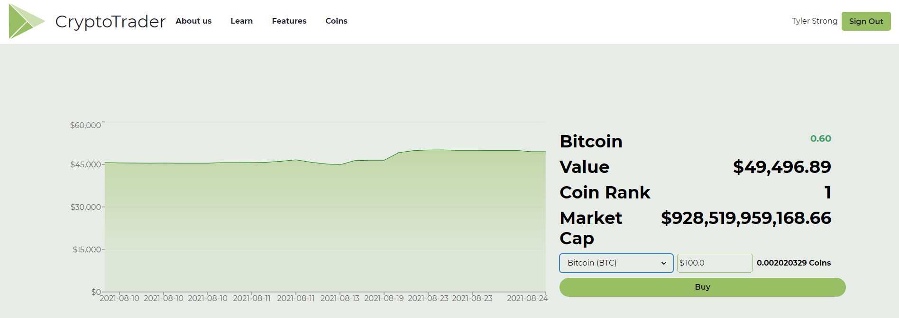

# Welcome to Crypto Trader (In Progress)

# To run the server and front end

-   CD into base directory and run <b> node --experimental-json-modules server.js </b>
-   CD into crypto-trader/client/src and run <b> npm start </b>

# Preview of the site

# Current status of the application:

-   Dynamic graphs and data are in place, next up is user data.
-   Currently not optimized for responsivity
-   Production of the application is on pause as I implement react-redux. I aim to refactor my code and organize my routes into separate files/folders for organizational purposes. I do not want to continue with the complexity of this application without proper organization :)

This app will utilize:

-   React.JS
-   Framer-motion (animations)
-   Chakra UI and some custom CSS files for the front end. (Styling)
-   Express.js (back end)
-   MongoDB (data storing in the cloud)
-   Cryptocurrency API (data fetching)
-   Lowdb (local database)

I intend to deploy this app to a live website.

Ending functionality will include:

-   The ability to sign up and create an account, including with Google auth.

-   The ability to "purchase, sell, and convert" cryptocurrencies in a simulated-esque fashion.

-   The ability to look at your portfolio history, total worth and other analytics in a text and graphical interface

-   The ability to look at price histories of 100 different cryptocurrencies with a graphical interface with Recharts to give users a pleasant visual experience.
